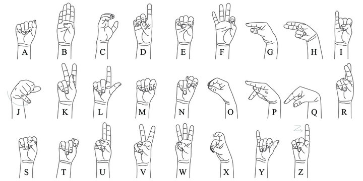

# Apprentissage supervisé : CNN-ASL
*Réalisé par Julie Ciesla et Pauline Hosti*


Dans le cadre de notre projet en réseaux de neurones et classification, nous avons choisi de développer un système de reconnaissance de la langue des signes américaines (ASL). Notre objectif principal est d'implémenter et d'entraîner un réseau de neurones capable d'identifier les lettres de l'ASL. Dans un second temps, nous avons mis en oeuvre une méthode pour "traduire" une vidéo en utilisant le réseau de neurones. 


## 👌 Qu'est-ce que l'ASL ?

La langue des signes américaines est un mode de communication visuel utilisé aux Etats-Unis et dans d'autres régions anglophones par les communautés sourdes et malentendantes. L'ASL utilise des signes statiques et dynamiques faisant intervenir mains, visage et buste pour représenter des mots et des concepts. 

Nous avons décidé de nous concentrer sur l'apprentissage des lettres de l'alphabet, représentées par des signes statiques. Voici les gestes associés à chaque lettre que nous nous proposons de reconnaître. 




## 🛠️ Manuel technique

### Prérequis 
 - **Python**: 3.11

### Librairies
 - **albumentations** : pour l'augmentation des données, offre des transformations efficaces pour les images
 - **OpenCV**: pour la reconnaissance de mains, traitements des images 
 - **numpy**
 - **matplotlib**
 - **pandas**
 - **PIL** : traitement des images
 - **PyTorch**: apprentissage profond
 - **os**

 

 Pour installer une librairie faire
 ```
pip install <nom librairie>
```

### Organisation

Nous avons organisé notre travail en trois notebooks : 
- data.ipynb
- models.ipynb
- modelsFineTuning.ipynb
- traduction.ipynb

**DATA**

Ce fichier contient toutes les informations nécessaires afin de récupérer les datasets que nous avons utilisé sur kaggle mais également celui que nous avons fini par réaliser. 

**MODELS**

Ce fichier contient les différents modèles que nous avons implémentés afin d'entraîner notre réseau de neurones. On y retrouve une analyse de chaque modèle.

**MODELS FINE TUNING**

Ce fichier contient la méthode et les résultats obtenus en faisant du transfert de connaissances en utilisant des modèles performants déjà pré-entraînés.

**TRADUCTION**

Ce fichier contient les différentes fonctions nous permettant, à partir d'une vidéo de lettres de l'alphabet successives, de séparer la vidéos en image (frames), de traduire chaque frames en une lettre et de donner une traduction texte complète de la vidéo.
